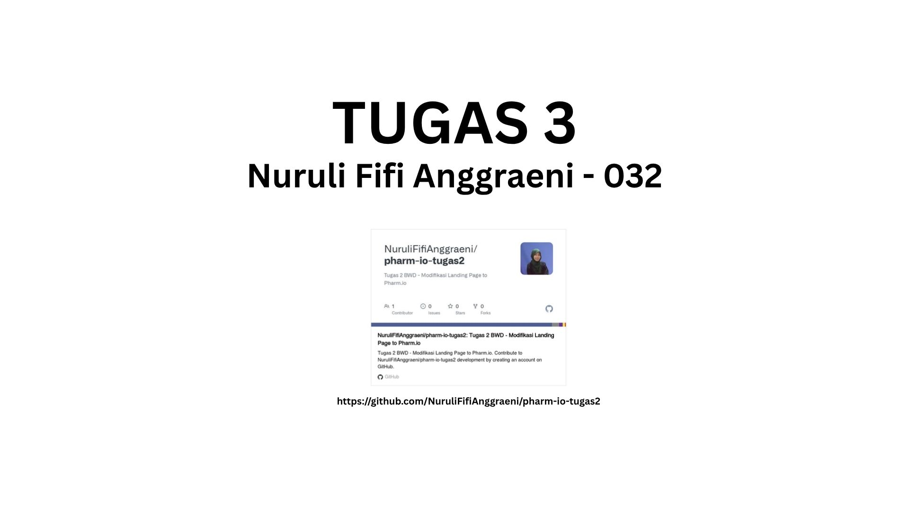
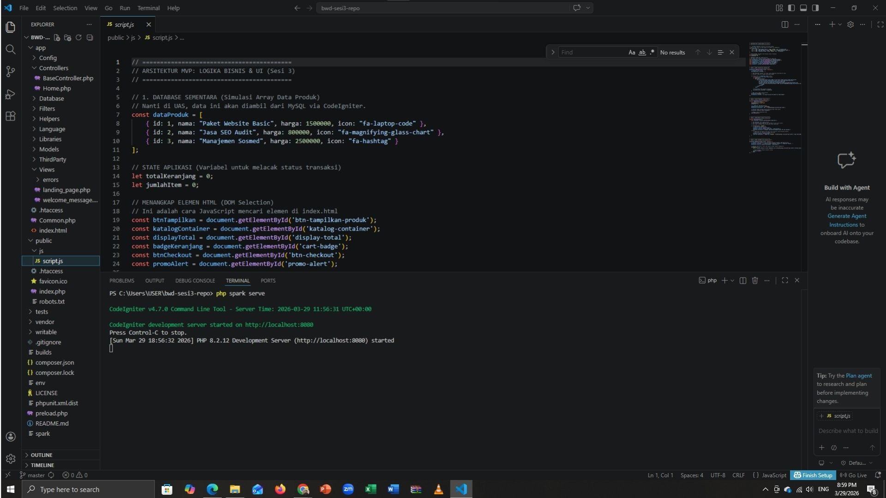
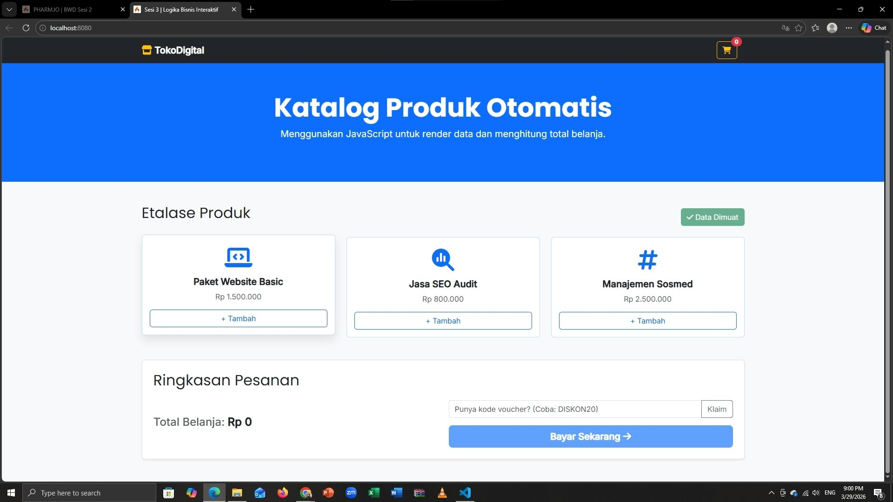
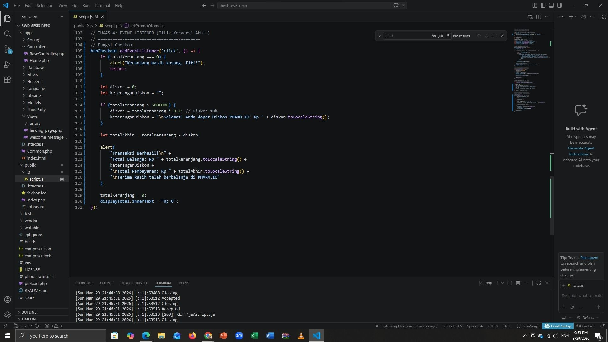
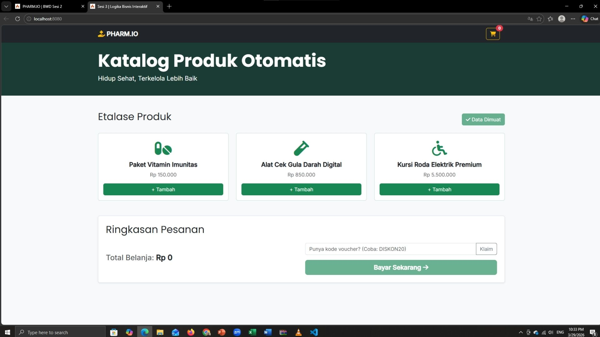
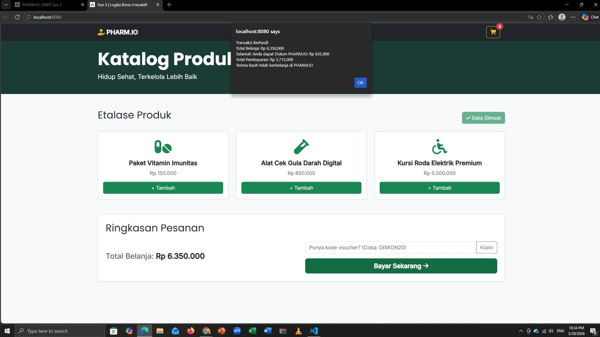

# 💊 PHARM.IO - Digital Pharmacy Solutions
**Tugas 3: Pemrograman Web (BWD Sesi 3)**

### 📋 Deskripsi 
- **Automatic Rendering**: Menggunakan JavaScript (Loop) untuk memuat katalog produk kesehatan.
- **Smart Logic Business**: Penerapan diskon otomatis sebesar **10%** untuk pembelian di atas **Rp 5.000.000**.
- **Checkout**: Simulasi proses transaksi dengan alert yang merinci total belanja, diskon, dan total akhir.

---

### 📸 Dokumentasi Pengerjaan

### 1. cover

### 2. Jalankan Server (PHP Spark Serve)

### 3. tampilan awal

### 4. Implementasi Logika Diskon (Conditionals)

### 5. Tampilan Katalog  PHARM.IO

### 6. Hasil Checkout & Diskon Berhasil

---
**Dikerjakan Oleh:**
* **Nama:** Nuruli Fifi Anggraeni
* **NIM:** 25120100032
* **Universitas:** Cakrawala University